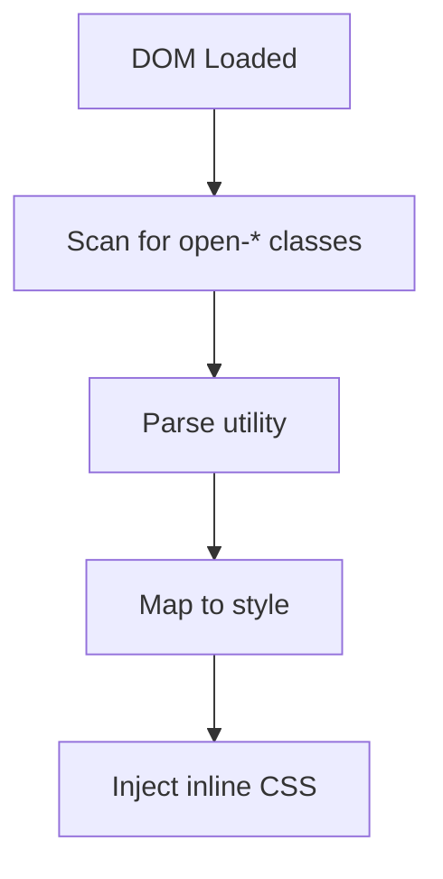

# ☕ openCSS

> A lightweight, utility-first runtime CSS engine — no build step, no bulky CSS files.


---

## Overview

**openCSS** dynamically scans your HTML at runtime and applies styles directly using JavaScript.

No:
- ❌ Build tools  
- ❌ CSS bundles  
- ❌ Configuration  

Just:
- ✅ Drop a script  
- ✅ Use utility classes  
- ✅ Get styled instantly  

---

## Quick Start

### 1. Add Script

```html
<script src="utilityV1.js"></script>
```

### 2. Use Classes

```html
<div class="open-bg-chai open-p-4 open-curved-md">
    <h1 class="open-text-white open-text-32">Hello openCSS</h1>
    <p class="open-text-beige open-text-14">
        Styled entirely via JavaScript at runtime.
    </p>
</div>
```

---

## 📦 Features

### 📏 Spacing System (8px scale)

| Class        | Value  |
|-------------|--------|
| open-p-1     | 8px    |
| open-p-2     | 16px   |
| open-p-4     | 32px   |

**Directional:**
```
open-pt-2 open-pr-4 open-pb-2 open-pl-4
```

---

### 🔤 Typography

```
open-text-14
open-text-32
open-text-96
```

**Alignment:**
```
open-text-center
open-text-right
open-text-left
```

---

### 📐 Layout (Flexbox)

```
open-flex
open-flex-row
open-flex-col
open-justify-center
open-items-center
open-gap-4
```

---

### 🔲 Borders & Radius

```
open-border-solid open-border-2
open-curved-sm
open-curved-lg
open-curved-full
open-curved-circle
```

---

### 🎨 Colors

**Background:**
```
open-bg-chai
open-bg-black
open-bg-emerald
```

**Text:**
```
open-text-white
open-text-earthy
open-text-cyan
```

---

## ⚙️ How It Works (V1)



### Process

1. Waits for DOM load  
2. Scans for `open-*` classes  
3. Matches utility to style object  
4. Injects inline styles  

---

## Limitations (V1)

- ❌ No responsive design  
- ❌ No hover/focus states  
- ❌ Redundancy   
- ❌ Inline styles only  

---

## Roadmap (V2)

### Major Improvements

#### 1. Dynamic Stylesheet Injection
- Single `<style>` tag  
- Better performance  

#### 2. Modifier Support
```html
md:hover:open-bg-chai
```

#### 3. CSS Escaping
```css
.md\:open-text-14 {}
```

#### 4. Breakpoints
- Mobile-first media queries  
- `sm`, `md`, `lg`

#### 5. Deduplication
- Uses `Set()`  
- No repeated CSS rules  

---

## 📁 Project Structure (Suggested)

```
openCSS/
│── utilityV1.js
│── README.md
│── examples/
│── docs/
```

[Watch Demo Video](https://youtu.be/4JjlIHfXhDE?si=Y-se5aFNtSM6caMk)
